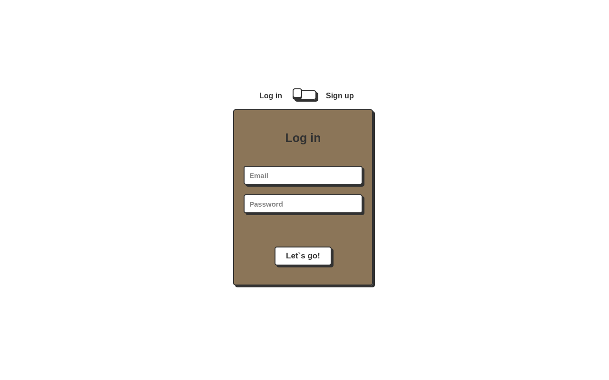

# Hospital Information Website

A website for a dental clinic, used by patients, doctors, and admins. It has a static frontend (HTML, CSS, Bootstrap, vanilla JavaScript) and a REST API built with Node.js, Express, and MongoDB.


## Features

- **Roles:** patients sign up themselves, admins add doctors, and each role sees only what it's allowed to.
- **Authentication:** passwords are hashed with bcrypt. Login returns a JWT (15-minute expiry), sent as a `Bearer` token and checked by `verifyToken` and `verifyRole` middleware.
- **Validation:** `express-validator` rules for signup and profile updates.
- **Profiles:** users view and edit their profile and upload a profile picture (Multer, stored on Cloudinary).
- **Frontend pages:** home, services, about, login/sign-up and profile, in `config/pages/`.



## API

All routes are under `/hospital`.

| Method | Route | Access |
|---|---|---|
| POST | `/patient/signup` | Public |
| POST | `/user/login` | Public |
| GET | `/user/profile` | Any logged-in user |
| PUT | `/user/update-profile` | Patient, doctor |
| POST | `/user/update-profile-picture` | Patient, doctor |
| GET | `/doctor/getDoctors` | Patient, admin |
| POST | `/doctor/addDoctor` | Admin |
| GET | `/patient/getPatients` | Doctor, admin |
| DELETE | `/user/delete` | Admin |

## Running locally

Create a `.env` file in the project root:

```bash
MONGO_URI=mongodb://127.0.0.1:27017/hospital
JWT_SECRET=change-me
CLOUDINARY_NAME=...
CLOUDINARY_API_KEY=...
CLOUDINARY_API_SECRET=...
CLOUDINARY_FOLDER=...
PORT=8080
```

Then:

```bash
npm install
npm run dev        # API on http://localhost:8080/hospital (nodemon)
```

Serve the repo root on `http://127.0.0.1:3000` (for example with VS Code Live Server) and open `config/pages/index.html`. The API's CORS setting allows that origin.

Tests use Jest and Supertest (`tests/`) and connect to the database in `MONGO_URI`:

```bash
npm test
```

## Project structure

| Folder | Contents |
|---|---|
| `index1.js` | Express app entry point |
| `routes/`, `controllers/` | User, patient, and doctor endpoints |
| `models/` | Mongoose `User` model (roles: patient, doctor, admin) |
| `middlewares/` | JWT verification, role checks, validation, Multer upload |
| `validators/` | `express-validator` rule sets |
| `config/` | Database and Cloudinary setup, plus the frontend (`pages/`, `scripts/`, `styles/`, `images/`) |
| `tests/` | Jest + Supertest suites |
